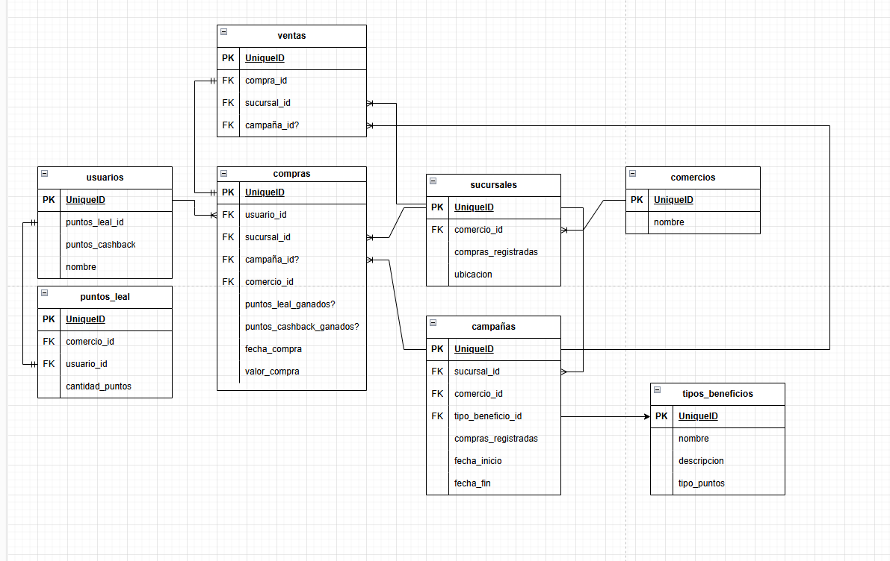
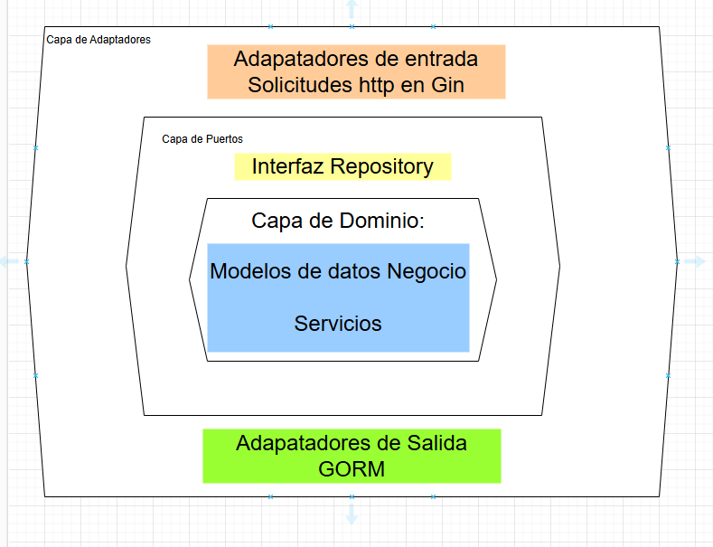
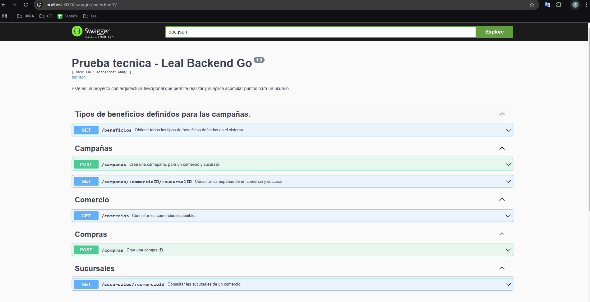

# Leal Backend

# Modelo Entidad Relacion

# Arquitectura utilizada

# Cómo inicializar el proyecto
1. Crea una base de datos en PostgreSQL con el nombre leal.
2. Configura tu archivo .env definiendo el puerto en el que el servidor escuchará las solicitudes y el DNS de conexión a la base de datos.
3. Agrega un comercio en la base de datos.
4. Agrega algunas sucursales en la base de datos.
5. Crea un usuario en la base de datos.
6. Crea los beneficios según lo descrito en el archivo tipo_beneficios.csv.
7. Utiliza el endpoint para crear una campaña. Asegúrate de respetar las relaciones con el comercio y las sucursales, además de asignar el tipo de beneficio que definiste en el paso anterior.
8. Utiliza el endpoint para consultar las campañas asociadas a un comercio y una sucursal.
9. Utiliza el endpoint para registrar una compra, lo que sumará puntos si corresponde.
10. Si necesitas visualizar las sucursales, comercios o tipos de beneficios creados en la base de datos, usa los endpoints relacionados con cada entidad.

# Swagger documentación de los endpoints

# Empezando
### Requisitos previos
- Go 1.22 (debería seguir siendo compatible con versiones anteriores)
- Ver mi video de Youtube para entender el loC <a HREF="https://www.youtube.com/watch?v=DKS--Wnxd1k"> Delen like ♥ </a>

# Herramientas usadas
1. <a HREF="https://github.com/gin-gonic/gin">Gin para manejar la capa de adaptadores entrantes. </a>
2. <a HREF="https://gorm.io/index.html"> Gorm para manejar la capa de adaptadores salientes. </a>
3. <a HREF="https://gorm.io/docs/connecting_to_the_database.html#PostgreSQL"> PostgreSQL como base de datos. </a>
